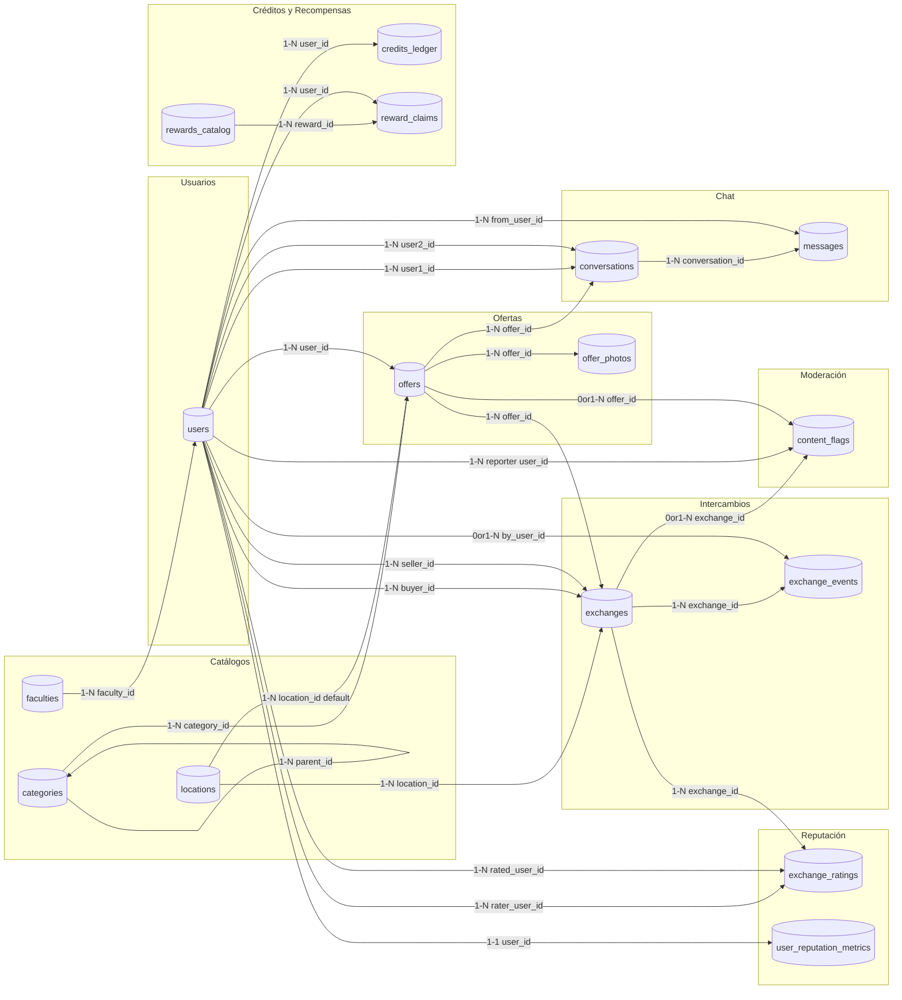

# Reuse — Modelo Entidad–Relación (ERD)

```mermaid
flowchart LR

  subgraph C[Catálogos]
    FACULTIES[(faculties)]
    CATEGORIES[(categories)]
    LOCATIONS[(locations)]
  end

  subgraph U[Usuarios]
    USERS[(users)]
  end

  subgraph O[Ofertas]
    OFFERS[(offers)]
    OFFER_PHOTOS[(offer_photos)]
  end

  subgraph CH[Chat]
    CONVERSATIONS[(conversations)]
    MESSAGES[(messages)]
  end

  subgraph X[Intercambios]
    EXCHANGES[(exchanges)]
    EXCHANGE_EVENTS[(exchange_events)]
  end

  subgraph CR[Créditos y Recompensas]
    CREDITS_LEDGER[(credits_ledger)]
    REWARDS_CATALOG[(rewards_catalog)]
    REWARD_CLAIMS[(reward_claims)]
  end

  subgraph M[Moderación]
    CONTENT_FLAGS[(content_flags)]
  end

  subgraph R[Reputación]
    EXCHANGE_RATINGS[(exchange_ratings)]
    USER_REPUTATION_METRICS[(user_reputation_metrics)]
  end

  FACULTIES -->|"1-N faculty_id"| USERS

  CATEGORIES -->|"1-N category_id"| OFFERS
  CATEGORIES -->|"1-N parent_id"| CATEGORIES

  LOCATIONS -->|"1-N location_id default"| OFFERS
  LOCATIONS -->|"1-N location_id"| EXCHANGES

  USERS -->|"1-N user_id"| OFFERS
  OFFERS -->|"1-N offer_id"| OFFER_PHOTOS

  OFFERS -->|"1-N offer_id"| CONVERSATIONS
  USERS -->|"1-N user1_id"| CONVERSATIONS
  USERS -->|"1-N user2_id"| CONVERSATIONS
  CONVERSATIONS -->|"1-N conversation_id"| MESSAGES
  USERS -->|"1-N from_user_id"| MESSAGES

  OFFERS -->|"1-N offer_id"| EXCHANGES
  USERS -->|"1-N buyer_id"| EXCHANGES
  USERS -->|"1-N seller_id"| EXCHANGES
  EXCHANGES -->|"1-N exchange_id"| EXCHANGE_EVENTS
  USERS -->|"0or1-N by_user_id"| EXCHANGE_EVENTS

  USERS -->|"1-N user_id"| CREDITS_LEDGER

  REWARDS_CATALOG -->|"1-N reward_id"| REWARD_CLAIMS
  USERS -->|"1-N user_id"| REWARD_CLAIMS

  USERS -->|"1-N reporter user_id"| CONTENT_FLAGS
  OFFERS -->|"0or1-N offer_id"| CONTENT_FLAGS
  EXCHANGES -->|"0or1-N exchange_id"| CONTENT_FLAGS

  EXCHANGES -->|"1-N exchange_id"| EXCHANGE_RATINGS
  USERS -->|"1-N rater_user_id"| EXCHANGE_RATINGS
  USERS -->|"1-N rated_user_id"| EXCHANGE_RATINGS

  USERS -->|"1-1 user_id"| USER_REPUTATION_METRICS
```